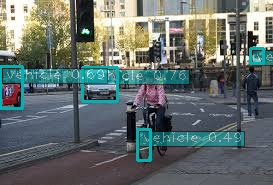

# 利用NVIDIA TensorRT加速交通环境感知
* 本次课程利用NVIDIA Transfer Learning Toolkit（后面使用TLT作为简称）训练模型，训练模型以及优化模型部分请参阅[TLT 开发者文档](https://docs.nvidia.com/metropolis/TLT/tlt-getting-started-guide/index.html)
* 本次课程针对有一定编程基础的开发者，需要对Python，深度学习，opencv等内容有一定了解
* 本次课程目标是利用NVIDIA TensorRT加速SSD-resnet18的交通目标检测模型，实现在图片，视频或者摄像头画面中检测出目标，并判断是哪一类
* 本次实验将道路标志分为四类，分别是交通标志(road_sign),汽车(vehicle),行人(pedestrian),两轮车(bicycle,包含自行车和摩托车)。
* 本次实验会提供基础的训练数据集，用于参赛队伍训练。但是，为了取得更好的成绩，需要对这个数据集需要进一步清理，扩展以及优化。
* 本次课程提供最基础的开发流程，以及相关工具和框架的使用方法，鼓励各位开发者在本教程的基础上做更多更好的优化。
* 本次课程实验作者需要以下实验环境:
  * **硬件平台**： NVIDIA Jetson NANO
  * **软件平台**： 
    1. NVIDIA Jetpack 4.4
    2. Ubuntu 18.04 L4T
    3. Python 3.6.9
    4. TensorRT 7.1
    5. CUDA 10.2
    6. Tensorflow 1.15
    7. NVIDIA Transfer Learning Toolkit 2.0
    8. Numpy 1.16.1
    9. Opencv 4.1.1
    


### TensorRT简介
* [NVIDIA TensorRT™](https://developer.nvidia.com/tensorrt)是一个用于高性能深度学习推理（inference）的SDK。它包括一个深度学习推理优化器和运行时加速库，为深度学习推理应用程序提供低延迟和高吞吐量。
* TensorRT现已能支持TensorFlow、Caffe、Mxnet、Pytorch等几乎所有的深度学习框架，将TensorRT和NVIDIA的GPU结合起来，能在几乎所有的框架中进行快速和高效的部署推理。
* TensorRT 是一个C++库，从 TensorRT 3 开始提供C++ API和Python API，主要用来针对 NVIDIA GPU进行 高性能推理（Inference）加速,现在最新版TensorRT 7.1。
* TensorRT 是专门用来做深度学习<font color=#008000 size=4>推理</font> 任务的,可以独立于训练框架使用。


**TensorRT优化方法主要有以下几种方式：**
  1. 网络层的融合和张量融合  
     TensorRT通过对层间的横向或纵向合并，使得层的数量大大减少。横向合并可以把卷积、偏置和激活层合并成一个CBR结构，只占用一个CUDA核心。纵向合并可以把结构相同，但是权值不同的层合并成一个更宽的层，也只占用一个CUDA核心。
  2. 数据精度校准  
      大部分深度学习训练框架训练出来的模型的数据精度都是FP32，但是训练完的神经网络在推理阶段并不需要太大的精度范围，完全可以降低数据精度，比如：FP16或者INT8。低精度的数据类型会占用更少的存储空间，也会使模型的体积更小，加速推理和减少延迟。
  3. 自动内核调整  
      利用NVIDIA TensorRT优化的模型，可以自动的根据您的网络和GPU平台调整算法，设置CUDA kernel，保证当前的模型在您的GPU上以最优的性能进行计算。  
  4. 动态的Memory管理  
      在每个tensor的使用期间，TensorRT会为其指定显存，避免显存的重复申请以及浪费。  
  5. 多流执行  
      为多个输入的情况而设计，可以在多个CUDA Stream中使用多个TensorRT推理引擎，并行的执行多个输入，比如同时处理多路摄像头
  

**下面我们讲用代码的形式说明如何利用TensorRT加速通过NVIDIA Transfer Learning训练的模型**

#### **1.导入需要的工具库**


```python
#1
import sys
import time
import argparse
import cv2
import pycuda.autoinit  # This is needed for initializing CUDA driver
import numpy as np
from utils.ssd_classes import get_cls_dict
#from utils.ssd import TrtSSD
from utils.camera import add_camera_args, Camera
from utils.display import open_window, set_display, show_fps
from utils.visualization import BBoxVisualization
import ctypes
#import cv2
#import tensorflow as tf
import tensorrt as trt
import pycuda.driver as cuda
```

#### **2.设置图像预处理方法以及输出处理方法**


```python
#2
def _preprocess_trt(img, shape=(300, 300)):
    """Preprocess an image before TRT SSD inferencing."""
    img = cv2.resize(img, shape)
    img = img.transpose((2, 0, 1)).astype(np.float32)
    return img


def _postprocess_trt(img, output, conf_th, output_layout):
    """Postprocess TRT SSD output."""
    img_h, img_w, _ = img.shape
    boxes, confs, clss = [], [], []
    #print(len(output))
    for prefix in range(0, len(output), output_layout):
        index = int(output[prefix+0])
        conf = float(output[prefix+2])
        if conf < conf_th:
            continue
        x1 = int(output[prefix+3] * img_w)
        y1 = int(output[prefix+4] * img_h)
        x2 = int(output[prefix+5] * img_w)
        y2 = int(output[prefix+6] * img_h)
        cls = int(output[prefix+1])
        boxes.append((x1, y1, x2, y2))
        confs.append(conf)
        clss.append(cls)
    return boxes, confs, clss
```

#### **3.利用tlt-converter工具将NVIDIA Transfer Learning Toolkit训练出来的模型转换成TensorRT推理引擎**
* 对于Jetson平台，您可以从[这里](https://developer.nvidia.com/tlt-converter-trt71)下载
* 在您使用tlt-converter工具之前，请您安装TensorRT OSS，详细步骤请参阅，[安装说明](https://docs.nvidia.com/metropolis/TLT/tlt-getting-started-guide/index.html#tensorrt_oss)
* 下面命令中的KEY是本节课使用的KEY，与作者训练出来的模型绑定，如果想使用自己训练的模型，请您前往[NGC官网](https://ngc.nvidia.com/catalog/)生成，并在Transfer Learning Toolkit中绑定
* 注意，这里可能需要花费稍微长点的时间


```python
%set_env KEY=cTJhcms3ODdvbHRsOWwxMTNvYW0yN3NuaHA6NTcyNGExMmUtYTA2MC00MjAwLTkxNmYtNmVkZTc4NmJlZjky
!./tlt-converter -k $KEY \
               -d 3,384,1248 \
               -o NMS \
               -e ssd/TRT_ssd_resnet18_traffic.bin \
               -m 1 \
               -t fp32 \
               -i nchw \
               ssd/ssd_resnet18_epoch_020.etlt
```

    env: KEY=cTJhcms3ODdvbHRsOWwxMTNvYW0yN3NuaHA6NTcyNGExMmUtYTA2MC00MjAwLTkxNmYtNmVkZTc4NmJlZjky
    [INFO] Detected 1 inputs and 2 output network tensors.


#### **4.定义SSD-mobilenet v2模型的推理引擎的加载**
* 当我们已经优化好了引擎的时候，我们可以将优化好的引擎以文件的形式写到硬盘上，我们称之为序列化文件（serialized file）或PLAN文件
* 我们下次想直接使用优化好的引擎的时候，我们可以通过读取硬盘上的序列化文件，并利用 <font color=#008000 size=4>deserialize_cuda_engine() </font>方法进行反序列化，生成可执行的引擎
* 利用序列化文件生成可执行引擎可以为我们节省大量的时间
* 不同平台（软件或硬件平台）上生成的引擎的序列化文件不能直接通用，相同平台（软件且硬件平台）或同一台设备上生成的引擎序列化文件可以直接用
* 所以，上一步利用tlt-converter转换模型必须要在您运行的设备上执行
* NVIDIA Transfer Learning Toolkit训练生成的模型可以直接复制到其他设备平台，在这些设备上转换后可以直接被NVIDIA TensorRT和Deepstream使用


```python
#3
class TrtSSD(object):
    """TrtSSD class encapsulates things needed to run TRT SSD."""
    #加载自定义组建，这里如果TensorRT版本小于7.0需要额外生成flattenconcat的自定义组件库
    def _load_plugins(self):
        if trt.__version__[0] < '7':
            ctypes.CDLL("ssd/libflattenconcat.so")
        trt.init_libnvinfer_plugins(self.trt_logger, '')
    #加载通过Transfer Learning Toolkit生成的推理引擎
    def _load_engine(self):
        TRTbin = 'ssd/TRT_%s.bin' % self.model
        with open(TRTbin, 'rb') as f, trt.Runtime(self.trt_logger) as runtime:
            return runtime.deserialize_cuda_engine(f.read())
    #通过加载的引擎，生成可执行的上下文
    def _create_context(self):
        for binding in self.engine:
            size = trt.volume(self.engine.get_binding_shape(binding)) * \
                   self.engine.max_batch_size
            ##注意：这里的host_mem需要时用pagelocked memory，以免内存被释放
            host_mem = cuda.pagelocked_empty(size, np.float32)
            cuda_mem = cuda.mem_alloc(host_mem.nbytes)
            self.bindings.append(int(cuda_mem))
            if self.engine.binding_is_input(binding):
                self.host_inputs.append(host_mem)
                self.cuda_inputs.append(cuda_mem)
            else:
                self.host_outputs.append(host_mem)
                self.cuda_outputs.append(cuda_mem)
        return self.engine.create_execution_context()
    #初始化引擎
    def __init__(self, model, input_shape, output_layout=7):
        """Initialize TensorRT plugins, engine and conetxt."""
        self.model = model
        self.input_shape = input_shape
        self.output_layout = output_layout
        self.trt_logger = trt.Logger(trt.Logger.INFO)
        self._load_plugins()
        self.engine = self._load_engine()

        self.host_inputs = []
        self.cuda_inputs = []
        self.host_outputs = []
        self.cuda_outputs = []
        self.bindings = []
        self.stream = cuda.Stream()
        self.context = self._create_context()
    #释放引擎，释放GPU显存，释放CUDA流
    def __del__(self):
        """Free CUDA memories."""
        del self.stream
        del self.cuda_outputs
        del self.cuda_inputs
    #利用生成的可执行上下文执行推理
    def detect(self, img, conf_th=0.3):
        """Detect objects in the input image."""
        img_resized = _preprocess_trt(img, self.input_shape)
        #print(img_resized.shape)
        np.copyto(self.host_inputs[0], img_resized.ravel())
        #将处理好的图片从CPU内存中复制到GPU显存
        cuda.memcpy_htod_async(
            self.cuda_inputs[0], self.host_inputs[0], self.stream)
        #开始执行推理任务
        self.context.execute_async(
            batch_size=1,
            bindings=self.bindings,
            stream_handle=self.stream.handle)
        #将推理结果输出从GPU显存复制到CPU内存
        cuda.memcpy_dtoh_async(
            self.host_outputs[1], self.cuda_outputs[1], self.stream)
        cuda.memcpy_dtoh_async(
            self.host_outputs[0], self.cuda_outputs[0], self.stream)
        self.stream.synchronize()


        output = self.host_outputs[0]
        #for x in output:
        #    print(str(x),end=' ')
        return _postprocess_trt(img, output, conf_th, self.output_layout)

```

**这里output输出每7个值为一组，分别是：**  
output[0]:  index  
output[1]:  class id  
output[2]:  confidence  
output[3]--output[6]:  bounding box  

#### **5.设置模型库**  
* 1.这里定义了多个模型库，我们选用的是**ssd_resnet18_traffic**
* 2.这里还定义了我们模型的输入（1248,384）


```python
#4
INPUT_HW = (1248, 384)
SUPPORTED_MODELS = [
    'ssd_mobilenet_v1_coco',
    'ssd_mobilenet_v1_egohands',
    'ssd_mobilenet_v2_coco',
    'ssd_mobilenet_v2_egohands',
    'ssd_mobilenet_v2_face',
    'ssd_mobilenet_v2_signs',
    'ssd_resnet18_traffic'
]
```

  

  
  
#### **6.开始读取视频并将输出可视化的画到图像上**
* detect_one()方法是检测单张图片，detect_video()方法是检测视频
* 注意：这里打印的fps值是包括将图像写到结果视频中的时间，如果取消将视频写到结果视频的功能，速度会有大幅度提升


```python
#5
def detect_video(video, trt_ssd, conf_th, vis,result_file_name):
    full_scrn = False
    fps = 0.0
    tic = time.time()
    frame_width = int(video.get(cv2.CAP_PROP_FRAME_WIDTH))
    frame_height = int(video.get(cv2.CAP_PROP_FRAME_HEIGHT))
    fps = video.get(cv2.CAP_PROP_FPS)
    #print(str(frame_width)+str(frame_height))
    ##定义输入编码
    fourcc = cv2.VideoWriter_fourcc('M', 'P', '4', 'V')
    videoWriter = cv2.VideoWriter('result.AVI', fourcc, fps, (frame_width,frame_height))
    ##开始循环检测，并将结果写到result.mp4中
    while True:
        ret,img = video.read()
        if img is not None:
            boxes, confs, clss = trt_ssd.detect(img, conf_th)
            img = vis.draw_bboxes(img, boxes, confs, clss)
            videoWriter.write(img)
            toc = time.time()
            curr_fps = 1.0 / (toc - tic)
            fps = curr_fps if fps == 0.0 else (fps*0.95 + curr_fps*0.05)
            tic = toc
            print("\rfps: "+str(fps),end="")
        else:
            break
```


```python
#6
def detect_one(img, trt_ssd, conf_th, vis):
    full_scrn = False
    tic = time.clock()
    ##开始检测，并将结果写到result.jpg中
    boxes, confs, clss = trt_ssd.detect(img, conf_th)
    toc = time.clock()
    curr_fps = (toc - tic)
    print("boxes: "+str(boxes))
    print("clss: "+str(clss))
    print("confs: "+str(confs))
    img = vis.draw_bboxes(img, boxes, confs, clss)
    cv2.imwrite("result.jpg",img)        
    print("time: "+str(curr_fps)+"(sec)")
```


```python
#7
import os
def detect_dir(dir, trt_ssd, conf_th, vis):
    dirs = os.listdir(dir)
    print(dir)
    for i in dirs:
        if os.path.splitext(i)[1] == ".png":
            full_scrn = False
            #print("val/images/"+str(i))
            img = cv2.imread("val/images/"+str(i))
            boxes, confs, clss = trt_ssd.detect(img, conf_th)
            new_file = open("mAP/input/detection-results/"+os.path.splitext(i)[0]+".txt",'w+')
            if len(clss)>0:
                for count in range(0, len(clss)):
                    if clss[count] == 0:
                        new_file.write("mandatory ")
                    elif clss[count] == 1:
                        new_file.write("prohibitory ")
                    elif clss[count] == 2:
                        new_file.write("warning ")
                    new_file.write(str(confs[count])+" ")
                    new_file.write(str(boxes[count][0])+" ")
                    new_file.write(str(boxes[count][1])+" ")
                    new_file.write(str(boxes[count][2])+" ")
                    new_file.write(str(boxes[count][3])+" \n")
```

#### **7.定义main()函数，定义需要检测的视频**
* 学生可以自行上传图像或视频到当前文件夹，并将filename请改成您要测试的图片或视频的名字


```python
#8
def main_one():    
    filename = "111.jpeg"
    result_file_name = str(filename)
    img = cv2.imread(filename)
    cls_dict = get_cls_dict("ssd_resnet18_traffic".split('_')[-1])
    model_name ="ssd_resnet18_traffic"
    trt_ssd = TrtSSD(model_name, INPUT_HW)
    vis = BBoxVisualization(cls_dict)
    print("start detection!")
    detect_one(img, trt_ssd, conf_th=0.35, vis=vis)
    cv2.destroyAllWindows()
    print("finish!")
```


```python
#9
def main_loop():   
    filename = "222.mp4"
    result_file_name = str(filename)
    video = cv2.VideoCapture(filename)
    cls_dict = get_cls_dict("ssd_resnet18_traffic".split('_')[-1])
    model_name ="ssd_resnet18_traffic"
    trt_ssd = TrtSSD(model_name, INPUT_HW)
    vis = BBoxVisualization(cls_dict)
    print("start detection!")
    detect_video(video, trt_ssd, conf_th=0.3, vis=vis, result_file_name=result_file_name)
    video.release()
    cv2.destroyAllWindows()
    print("\nfinish!")
```


```python
#10
def create_detect_result():    
    #filename = "test_face.jpg"
    #result_file_name = str(filename)
    dir = "val/images"
    #img = cv2.imread(filename)
    cls_dict = get_cls_dict("ssd_mobilenet_v2_signs".split('_')[-1])
    print(cls_dict)
    model_name ="ssd_mobilenet_v2_signs"
    trt_ssd = TrtSSD(model_name, INPUT_HW)
    vis = BBoxVisualization(cls_dict)
    print("start detection!")
    detect_dir(dir, trt_ssd, conf_th=0.2, vis=vis)
    cv2.destroyAllWindows()
    print("finish!")
```


```python
#11
create_detect_result()
```

    model name: signs
    {0: 'mandatory', 1: 'prohibitory', 2: 'warning'}
    start detection!
    val/images
    finish!


```python
#12
from IPython.display import Image
main_one()
Image("result.jpg")
```

    model name: traffic
    start detection!
    boxes: [(82, 67, 117, 101), (0, 66, 22, 108), (137, 129, 150, 160), (250, 48, 263, 63)]
    clss: [1, 1, 1, 1]
    confs: [0.7640599608421326, 0.6871962547302246, 0.4907781183719635, 0.3623530864715576]
    time: 0.05458100000000066(sec)
    finish!





```python
#13
!python mAP/main.py
```

    mandatory AP  = 20.65%
    prohibitory AP  = 64.27%
    warning AP  = 80.86%
    mAP = 55.26%


```python
main_loop()
```

    model name: traffic
    start detection!
    fps: 12.671534715018498
    finish!


#### **8.开始执行**
* 下面检测图像分为两部分，上面一个(**main_one()** 方法)是检测单张图片，测试检测时间。下面一个(**main_loop()** 方法)是以视频为输入进行检测，测试总的检测速度.
* 检测视频部分由于要将检测的结果写到硬盘上，所以时间会加倍，如果要得到和单张检测相似的数据，可以将读写的语句注释掉
* 检测到的交通标志会以矩形框标出，并标注具体类别


```python
#14
from IPython.display import Image
main_one()
Image("result.jpg")
```

    model name: traffic
    start detection!
    boxes: [(82, 67, 117, 101), (0, 66, 22, 108), (137, 129, 150, 160), (250, 48, 263, 63)]
    clss: [1, 1, 1, 1]
    confs: [0.7640599608421326, 0.6871962547302246, 0.4907781183719635, 0.3623530864715576]
    time: 0.03817999999998278(sec)
    finish!


```python
#15
main_loop()
```

    model name: traffic
    start detection!
    fps: 12.527739316760185
    finish!


#### **9.将生成的视频转码，以便能够在Jupyter Notebook中查看**
* 这里采用的是利用GPU加速的转码技术，将输出的视频转换到MP4格式，比单纯使用CPU进行转码的速度有大幅度提升


```python
#16
!rm result-ffmpeg4.mp4
!ffmpeg -i result.AVI -vcodec libx264 -f mp4 result-ffmpeg4.mp4 
```

    ffmpeg version 3.4.6-0ubuntu0.18.04.1 Copyright (c) 2000-2019 the FFmpeg developers
      built with gcc 7 (Ubuntu/Linaro 7.3.0-16ubuntu3)
      configuration: --prefix=/usr --extra-version=0ubuntu0.18.04.1 --toolchain=hardened --libdir=/usr/lib/aarch64-linux-gnu --incdir=/usr/include/aarch64-linux-gnu --enable-gpl --disable-stripping --enable-avresample --enable-avisynth --enable-gnutls --enable-ladspa --enable-libass --enable-libbluray --enable-libbs2b --enable-libcaca --enable-libcdio --enable-libflite --enable-libfontconfig --enable-libfreetype --enable-libfribidi --enable-libgme --enable-libgsm --enable-libmp3lame --enable-libmysofa --enable-libopenjpeg --enable-libopenmpt --enable-libopus --enable-libpulse --enable-librubberband --enable-librsvg --enable-libshine --enable-libsnappy --enable-libsoxr --enable-libspeex --enable-libssh --enable-libtheora --enable-libtwolame --enable-libvorbis --enable-libvpx --enable-libwavpack --enable-libwebp --enable-libx265 --enable-libxml2 --enable-libxvid --enable-libzmq --enable-libzvbi --enable-omx --enable-openal --enable-opengl --enable-sdl2 --enable-libdc1394 --enable-libdrm --enable-libiec61883 --enable-chromaprint --enable-frei0r --enable-libopencv --enable-libx264 --enable-shared
      libavutil      55. 78.100 / 55. 78.100
      libavcodec     57.107.100 / 57.107.100
      libavformat    57. 83.100 / 57. 83.100
      libavdevice    57. 10.100 / 57. 10.100
      libavfilter     6.107.100 /  6.107.100
      libavresample   3.  7.  0 /  3.  7.  0
      libswscale      4.  8.100 /  4.  8.100
      libswresample   2.  9.100 /  2.  9.100
      libpostproc    54.  7.100 / 54.  7.100
    Input #0, avi, from 'result.AVI':
      Metadata:
        encoder         : Lavf57.83.100
      Duration: 00:02:52.04, start: 0.000000, bitrate: 1443 kb/s
        Stream #0:0: Video: mpeg4 (Simple Profile) (FMP4 / 0x34504D46), yuv420p, 426x240 [SAR 1:1 DAR 71:40], 1437 kb/s, 30.03 fps, 30 tbr, 30.03 tbn, 30033 tbc
    Stream mapping:
      Stream #0:0 -> #0:0 (mpeg4 (native) -> h264 (libx264))
    Press [q] to stop, [?] for help
    [libx264 @ 0x559f141400] using SAR=1/1
    [libx264 @ 0x559f141400] using cpu capabilities: ARMv8 NEON
    [libx264 @ 0x559f141400] profile High, level 2.1
    [libx264 @ 0x559f141400] 264 - core 152 r2854 e9a5903 - H.264/MPEG-4 AVC codec - Copyleft 2003-2017 - http://www.videolan.org/x264.html - options: cabac=1 ref=3 deblock=1:0:0 analyse=0x3:0x113 me=hex subme=7 psy=1 psy_rd=1.00:0.00 mixed_ref=1 me_range=16 chroma_me=1 trellis=1 8x8dct=1 cqm=0 deadzone=21,11 fast_pskip=1 chroma_qp_offset=-2 threads=3 lookahead_threads=1 sliced_threads=0 nr=0 decimate=1 interlaced=0 bluray_compat=0 constrained_intra=0 bframes=3 b_pyramid=2 b_adapt=1 b_bias=0 direct=1 weightb=1 open_gop=0 weightp=2 keyint=250 keyint_min=25 scenecut=40 intra_refresh=0 rc_lookahead=40 rc=crf mbtree=1 crf=23.0 qcomp=0.60 qpmin=0 qpmax=69 qpstep=4 ip_ratio=1.40 aq=1:1.00
    Output #0, mp4, to 'result-ffmpeg4.mp4':
      Metadata:
        encoder         : Lavf57.83.100
        Stream #0:0: Video: h264 (libx264) (avc1 / 0x31637661), yuv420p, 426x240 [SAR 1:1 DAR 71:40], q=-1--1, 30 fps, 15360 tbn, 30 tbc
        Metadata:
          encoder         : Lavc57.107.100 libx264
        Side data:
          cpb: bitrate max/min/avg: 0/0/0 buffer size: 0 vbv_delay: -1
    Past duration 0.601036 too large4kB time=00:00:16.10 bitrate= 521.1kbits/s speed= 1.3x     
    Past duration 0.602135 too large
    Past duration 0.603233 too large
    Past duration 0.604332 too large
    Past duration 0.605431 too large
    Past duration 0.606529 too large
    Past duration 0.607628 too large
    Past duration 0.608727 too large 1024kB time=00:00:16.80 bitrate= 499.3kbits/s speed= 1.3x    
    Past duration 0.609825 too large
    Past duration 0.610924 too large
    Past duration 0.612022 too large
    Past duration 0.613121 too large
    Past duration 0.614220 too large
    Past duration 0.615318 too large
    Past duration 0.616417 too large
    Past duration 0.617516 too large
    Past duration 0.618614 too large
    Past duration 0.619713 too large
    Past duration 0.620811 too large
    Past duration 0.621910 too large
    Past duration 0.623009 too large
    Past duration 0.624107 too large
    Past duration 0.625206 too large
    Past duration 0.626305 too large
    Past duration 0.627403 too large
    Past duration 0.628502 too large
    Past duration 0.629601 too large
    Past duration 0.630699 too large 1024kB time=00:00:17.46 bitrate= 480.3kbits/s speed= 1.3x    
    Past duration 0.631798 too large
    Past duration 0.632896 too large
    Past duration 0.633995 too large
    Past duration 0.635094 too large
    Past duration 0.636192 too large
    Past duration 0.637291 too large
    Past duration 0.638390 too large
    Past duration 0.639488 too large
    Past duration 0.640587 too large
    Past duration 0.641685 too large
    Past duration 0.642784 too large
    Past duration 0.643883 too large
    Past duration 0.644981 too large 1024kB time=00:00:17.90 bitrate= 468.7kbits/s speed=1.28x    
    Past duration 0.646080 too large
    Past duration 0.647179 too large
    Past duration 0.648277 too large
    Past duration 0.649376 too large
    Past duration 0.650475 too large
    Past duration 0.651573 too large
    Past duration 0.652672 too large
    Past duration 0.653770 too large
    Past duration 0.654869 too large
    Past duration 0.655968 too large
    Past duration 0.657066 too large
    Past duration 0.658165 too large
    Past duration 0.659264 too large
    Past duration 0.660362 too large
    Past duration 0.661461 too large 1024kB time=00:00:18.40 bitrate= 455.9kbits/s speed=1.27x    
    Past duration 0.662560 too large
    Past duration 0.663658 too large
    Past duration 0.664757 too large
    Past duration 0.665855 too large
    Past duration 0.666954 too large
    Past duration 0.668053 too large
    Past duration 0.669151 too large
    Past duration 0.670250 too large
    Past duration 0.671349 too large
    Past duration 0.672447 too large
    Past duration 0.673546 too large
    Past duration 0.674644 too large
    Past duration 0.675743 too large
    Past duration 0.676842 too large
    Past duration 0.677940 too large
    Past duration 0.679039 too large
    Past duration 0.680138 too large
    Past duration 0.681236 too large
    Past duration 0.682335 too large 1024kB time=00:00:19.03 bitrate= 440.8kbits/s speed=1.27x    
    Past duration 0.683434 too large
    Past duration 0.684532 too large
    Past duration 0.685631 too large
    Past duration 0.686729 too large
    Past duration 0.687843 too large
    Past duration 0.688942 too large
    Past duration 0.690041 too large
    Past duration 0.691139 too large
    Past duration 0.692238 too large
    Past duration 0.693336 too large
    Past duration 0.694435 too large
    Past duration 0.695534 too large
    Past duration 0.696632 too large
    Past duration 0.697731 too large
    Past duration 0.698830 too large
    Past duration 0.699928 too large 1280kB time=00:00:19.56 bitrate= 535.9kbits/s speed=1.27x    
    Past duration 0.701027 too large
    Past duration 0.702126 too large
    Past duration 0.703224 too large
    Past duration 0.704323 too large
    Past duration 0.705421 too large
    Past duration 0.706520 too large
    Past duration 0.707619 too large
    Past duration 0.708717 too large
    Past duration 0.709816 too large
    Past duration 0.710915 too large
    Past duration 0.712013 too large
    Past duration 0.713112 too large
    Past duration 0.714211 too large
    Past duration 0.715309 too large
    Past duration 0.716408 too large
    Past duration 0.717506 too large
    Past duration 0.718605 too large
    Past duration 0.719704 too large 1280kB time=00:00:20.16 bitrate= 520.0kbits/s speed=1.26x    
    Past duration 0.720802 too large
    Past duration 0.721901 too large
    Past duration 0.723000 too large
    Past duration 0.724098 too large
    Past duration 0.725197 too large
    Past duration 0.726295 too large
    Past duration 0.727394 too large
    Past duration 0.728493 too large
    Past duration 0.729591 too large
    Past duration 0.730690 too large
    Past duration 0.731789 too large
    Past duration 0.732887 too large
    Past duration 0.733986 too large
    Past duration 0.735085 too large 1280kB time=00:00:20.63 bitrate= 508.2kbits/s speed=1.25x    
    Past duration 0.736183 too large
    Past duration 0.737282 too large
    Past duration 0.738380 too large
    Past duration 0.739479 too large
    Past duration 0.740578 too large
    Past duration 0.741676 too large
    Past duration 0.742775 too large
    Past duration 0.743874 too large
    Past duration 0.744972 too large
    Past duration 0.746071 too large
    Past duration 0.747169 too large
    Past duration 0.748268 too large
    Past duration 0.749367 too large
    Past duration 0.750465 too large
    Past duration 0.751564 too large
    Past duration 0.752663 too large
    Past duration 0.753761 too large 1280kB time=00:00:21.20 bitrate= 494.6kbits/s speed=1.24x    
    Past duration 0.754860 too large
    Past duration 0.755959 too large
    Past duration 0.757057 too large
    Past duration 0.758156 too large
    Past duration 0.759254 too large
    Past duration 0.760353 too large
    Past duration 0.761452 too large
    Past duration 0.762550 too large
    Past duration 0.763649 too large
    Past duration 0.764748 too large
    Past duration 0.765846 too large
    Past duration 0.766945 too large
    Past duration 0.768044 too large
    Past duration 0.769142 too large
    Past duration 0.770241 too large
    Past duration 0.771339 too large
    Past duration 0.772438 too large
    Past duration 0.773537 too large
    Past duration 0.774635 too large
    Past duration 0.775734 too large
    Past duration 0.776833 too large
    Past duration 0.777931 too large
    Past duration 0.779030 too large
    Past duration 0.780128 too large 1280kB time=00:00:22.00 bitrate= 476.6kbits/s speed=1.25x    
    Past duration 0.781227 too large
    Past duration 0.782326 too large
    Past duration 0.783424 too large
    Past duration 0.784523 too large
    Past duration 0.785622 too large
    Past duration 0.786720 too large
    Past duration 0.787819 too large
    Past duration 0.788918 too large
    Past duration 0.790016 too large
    Past duration 0.791115 too large
    Past duration 0.792213 too large
    Past duration 0.793327 too large
    Past duration 0.794426 too large
    Past duration 0.795525 too large
    Past duration 0.796623 too large
    Past duration 0.797722 too large
    Past duration 0.798820 too large
    Past duration 0.799919 too large
    Past duration 0.801018 too large
    Past duration 0.802116 too large
    Past duration 0.803215 too large
    Past duration 0.804314 too large
    Past duration 0.805412 too large
    Past duration 0.806511 too large
    Past duration 0.807610 too large
    Past duration 0.808708 too large
    Past duration 0.809807 too large
    Past duration 0.810905 too large
    Past duration 0.812004 too large
    Past duration 0.813103 too large
    Past duration 0.814201 too large
    Past duration 0.815300 too large
    Past duration 0.816399 too large 1280kB time=00:00:23.10 bitrate= 453.9kbits/s speed=1.28x    
    Past duration 0.817497 too large
    Past duration 0.818596 too large
    Past duration 0.819695 too large
    Past duration 0.820793 too large
    Past duration 0.821892 too large
    Past duration 0.822990 too large
    Past duration 0.824089 too large
    Past duration 0.825188 too large
    Past duration 0.826286 too large
    Past duration 0.827385 too large
    Past duration 0.828484 too large
    Past duration 0.829582 too large
    Past duration 0.830681 too large
    Past duration 0.831779 too large
    Past duration 0.832878 too large
    Past duration 0.833977 too large
    Past duration 0.835075 too large
    Past duration 0.836174 too large
    Past duration 0.837273 too large
    Past duration 0.838371 too large
    Past duration 0.839470 too large
    Past duration 0.840569 too large
    Past duration 0.841667 too large
    Past duration 0.842766 too large
    Past duration 0.843864 too large
    Past duration 0.844963 too large
    Past duration 0.846062 too large
    Past duration 0.847160 too large
    Past duration 0.848259 too large
    Past duration 0.849358 too large
    Past duration 0.850456 too large
    Past duration 0.851555 too large
    Past duration 0.852654 too large
    Past duration 0.853752 too large
    Past duration 0.854851 too large
    Past duration 0.855949 too large 1536kB time=00:00:24.30 bitrate= 517.8kbits/s speed=1.31x    
    Past duration 0.857048 too large
    Past duration 0.858147 too large
    Past duration 0.859245 too large
    Past duration 0.860344 too large
    Past duration 0.861443 too large
    Past duration 0.862541 too large
    Past duration 0.863640 too large
    Past duration 0.864738 too large
    Past duration 0.865837 too large
    Past duration 0.866936 too large
    Past duration 0.868034 too large
    Past duration 0.869133 too large
    Past duration 0.870232 too large
    Past duration 0.871330 too large
    Past duration 0.872429 too large
    Past duration 0.873528 too large
    Past duration 0.874626 too large
    Past duration 0.875725 too large
    Past duration 0.876823 too large
    Past duration 0.877922 too large
    Past duration 0.879021 too large
    Past duration 0.880119 too large
    Past duration 0.881218 too large
    Past duration 0.882317 too large
    Past duration 0.883415 too large
    Past duration 0.884514 too large
    Past duration 0.885612 too large
    Past duration 0.886711 too large
    Past duration 0.887810 too large
    Past duration 0.888908 too large
    Past duration 0.890007 too large
    Past duration 0.891106 too large
    Past duration 0.892204 too large
    Past duration 0.893303 too large
    Past duration 0.894402 too large
    Past duration 0.895500 too large
    Past duration 0.896599 too large 1536kB time=00:00:25.53 bitrate= 492.8kbits/s speed=1.33x    
    Past duration 0.897697 too large
    Past duration 0.898796 too large
    Past duration 0.899910 too large
    Past duration 0.901009 too large
    Past duration 0.902107 too large
    Past duration 0.903206 too large
    Past duration 0.904305 too large
    Past duration 0.905403 too large
    Past duration 0.906502 too large
    Past duration 0.907600 too large
    Past duration 0.908699 too large
    Past duration 0.909798 too large
    Past duration 0.910896 too large
    Past duration 0.911995 too large
    Past duration 0.913094 too large
    Past duration 0.914192 too large
    Past duration 0.915291 too large
    Past duration 0.916389 too large
    Past duration 0.917488 too large
    Past duration 0.918587 too large
    Past duration 0.919685 too large
    Past duration 0.920784 too large
    Past duration 0.921883 too large
    Past duration 0.922981 too large
    Past duration 0.924080 too large
    Past duration 0.925179 too large
    Past duration 0.926277 too large
    Past duration 0.927376 too large
    Past duration 0.928474 too large
    Past duration 0.929573 too large
    Past duration 0.930672 too large
    Past duration 0.931770 too large
    Past duration 0.932869 too large
    Past duration 0.933968 too large
    Past duration 0.935066 too large
    Past duration 0.936165 too large
    Past duration 0.937263 too large
    Past duration 0.938362 too large
    Past duration 0.939461 too large
    Past duration 0.940559 too large 1536kB time=00:00:26.86 bitrate= 468.4kbits/s speed=1.37x    
    Past duration 0.941658 too large
    Past duration 0.942757 too large
    Past duration 0.943855 too large
    Past duration 0.944954 too large
    Past duration 0.946053 too large
    Past duration 0.947151 too large
    Past duration 0.948250 too large
    Past duration 0.949348 too large
    Past duration 0.950447 too large
    Past duration 0.951546 too large
    Past duration 0.952644 too large
    Past duration 0.953743 too large
    Past duration 0.954842 too large
    Past duration 0.955940 too large
    Past duration 0.957039 too large
    Past duration 0.958138 too large
    Past duration 0.959236 too large
    Past duration 0.960335 too large
    Past duration 0.961433 too large
    Past duration 0.962532 too large
    Past duration 0.963631 too large
    Past duration 0.964729 too large
    Past duration 0.965828 too large
    Past duration 0.966927 too large
    Past duration 0.968025 too large
    Past duration 0.969124 too large
    Past duration 0.970222 too large
    Past duration 0.971321 too large
    Past duration 0.972420 too large
    Past duration 0.973518 too large
    Past duration 0.974617 too large
    Past duration 0.975716 too large
    Past duration 0.976814 too large 1536kB time=00:00:27.96 bitrate= 449.9kbits/s speed=1.39x    
    Past duration 0.977913 too large
    Past duration 0.979012 too large
    Past duration 0.980110 too large
    Past duration 0.981209 too large
    Past duration 0.982307 too large
    Past duration 0.983406 too large
    Past duration 0.984505 too large
    Past duration 0.985603 too large
    Past duration 0.986702 too large
    Past duration 0.987801 too large
    Past duration 0.988899 too large
    Past duration 0.989998 too large
    Past duration 0.991096 too large
    Past duration 0.992195 too large
    Past duration 0.993294 too large
    Past duration 0.994392 too large
    Past duration 0.995491 too large
    Past duration 0.996590 too large
    Past duration 0.997688 too large
    Past duration 0.998787 too large
    Past duration 0.999886 too large
    frame= 5163 fps= 45 q=-1.0 Lsize=    8327kB time=00:02:52.00 bitrate= 396.6kbits/s dup=0 drop=4 speed=1.51x    
    video:8276kB audio:0kB subtitle:0kB other streams:0kB global headers:0kB muxing overhead: 0.619388%
    [libx264 @ 0x559f141400] frame I:33    Avg QP:20.70  size: 15021
    [libx264 @ 0x559f141400] frame P:2665  Avg QP:24.54  size:  2043
    [libx264 @ 0x559f141400] frame B:2465  Avg QP:31.04  size:  1028
    [libx264 @ 0x559f141400] consecutive B-frames: 30.6% 14.2%  9.5% 45.8%
    [libx264 @ 0x559f141400] mb I  I16..4:  6.6% 67.6% 25.8%
    [libx264 @ 0x559f141400] mb P  I16..4:  0.6%  2.9%  1.6%  P16..4: 29.4% 11.6%  7.3%  0.0%  0.0%    skip:46.5%
    [libx264 @ 0x559f141400] mb B  I16..4:  0.3%  0.6%  0.9%  B16..8: 27.2%  6.0%  1.9%  direct: 1.3%  skip:61.8%  L0:47.4% L1:45.4% BI: 7.2%
    [libx264 @ 0x559f141400] 8x8 transform intra:53.6% inter:62.3%
    [libx264 @ 0x559f141400] coded y,uvDC,uvAC intra: 74.2% 76.4% 40.2% inter: 12.8% 13.3% 4.8%
    [libx264 @ 0x559f141400] i16 v,h,dc,p: 21% 50% 18% 11%
    [libx264 @ 0x559f141400] i8 v,h,dc,ddl,ddr,vr,hd,vl,hu: 19% 31% 24%  3%  4%  4%  5%  4%  6%
    [libx264 @ 0x559f141400] i4 v,h,dc,ddl,ddr,vr,hd,vl,hu: 24% 33% 12%  4%  5%  5%  6%  5%  6%
    [libx264 @ 0x559f141400] i8c dc,h,v,p: 36% 35% 23%  6%
    [libx264 @ 0x559f141400] Weighted P-Frames: Y:0.3% UV:0.2%
    [libx264 @ 0x559f141400] ref P L0: 72.6% 13.2% 10.2%  4.0%  0.0%
    [libx264 @ 0x559f141400] ref B L0: 86.7% 10.6%  2.6%
    [libx264 @ 0x559f141400] ref B L1: 95.5%  4.5%
    [libx264 @ 0x559f141400] kb/s:393.89


#### 10.查看结果视频


```python
#17
from IPython.display import Video

Video("result-ffmpeg4.mp4")
```


<video src="result-ffmpeg4.mp4" controls  >
      Your browser does not support the <code>video</code> element.
    </video>


### 课后总结
* 1.TensorRT是一个GPU推理引擎，能够利用NVIDIA GPU加速深度学习模型的推理。
* 2.NVIDIA Transfer Learning Toolkit是一个加速深度学习训练过程的工具包，包含迁移式学习，模型剪枝，模型训练等核心功能。能够直接输出支持NVIDIA TensorRT和Deepstream格式的模型。
* 3.结合TensorRT和Transfer Learning Toolkit两个工具，可以轻松地建立一个从数据到推理引擎的工作流程。
* 4.TensorRT支持目前常见的几乎所有框架训练出来的模型格式，用户也可以自行优化。
* 5.TensorRT推理引擎的创建，需要掌握一些CUDA相关的知识，为了让用户更加详细了解NVIDIA 生态工具，建议大家尝试学习CUDA。

### 课后扩展  
* 1.本次实验使用的是SSD-resnet18模型，模型本身比较轻量，大家可以考虑更换resnet其他模型或其他TLT支持的模型，提高检测精度
* 2.本次课程使用的数据集不大，模型最终的mPA为0.80，建议学生可以自己标注更多地数据集进行训练，提高检测精度
* 3.本次课程因为是远程的缘故处理的是本机的视频输入，学生可以自行更改，尝试使用CSI摄像头，rtsp摄像头或者web request等形式的图像输入
* 4.本次课程中涉及到的关于TensorRT和Transfer Learning Toolkit的视频内容资料，请访问[NVIDIA 开发者社区课程](https://www.nvidia.cn/developer/online-training/dli-community-training/)

### 比赛评分规则
本次比赛最终成绩由以下四部分组成：
* 1.模型推理精度（60%）：将最终提交的模型在NANO节点上进行推理，根据组委会提供的数据集得出推理结果并计算出mAP，所有队伍进行排名。精度部分的最终成绩为:
       accFinal = 60-(accRank-1)
* 2.模型速度（30%）：将最终提交的模型在NANO节点上进行推理，根据组委会提供的测试视频进行推理并计算出FPS，所有队伍进行排名。速度部分的最终成绩为：
       fpsFinal = 30-(fpsRank-1)*0.5
* 3.整体结构设计（5%）：如果在最终的测试中，能够重构推理部分的代码结构(将#3部分的代码重构或利用C/C++将其封装)，则最终成绩isRestructure加5分
* 4.网络模型重构（5%）：本教程提供的是ssd-resnet18的网络推理模型，如果能够更改代码利用其他模型进行推理，则最终成绩isOthermodel加5分（修改resnet18加3分，修改ssd加5分，如利用ssd-mobilenet则加3分，利用yolo-resnet18加5分）。

最终成绩为：Final = accFinal + fpsFinal + isRestructure + isOthermodel


```python

```


```python

```


```python

```
